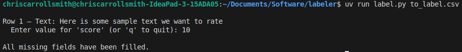

# Simple Data Labeler

I was kind of annoyed that there didn't seem to be any dead-simple tools for human labeling of text data, so I created this command-line tool for the purpose.

## Usage

1. Clone this repository with `git clone https://github.com/chriscarrollsmith/simple-data-labeler.git`.
1. Put your CSV file in the folder. The CSV file should have text data you want to label in the left column, and empty columns (with named headers) for the fields you want to fill in.
1. Open a terminal in the folder. (On most systems, you can right-click in the folder in your Finder or Explorer window and select "Open in Terminal".)
1. Install `uv` with `curl -LsSf https://astral.sh/uv/install.sh | sh` (see [documentation](https://docs.astral.sh/uv/getting-started/installation/) for details).
1. Install Python with `uv python install`.
1. Install dependencies with `uv sync`.
1. Run the script with `uv run label.py to_label.csv`. (Replace `to_label.csv` with the name of your CSV file.)

For example, if your input CSV looks like this:

``` csv
text_data,score
"Here is some sample text we want to rate",
```

Then the interface will look like this:



And the output CSV will look like this:

``` csv
text_data,score
"Here is some sample text we want to rate",10
```

Feel free to quit early by pressing `q` at any time. The data you've entered so far will be saved to the CSV file, and you can continue later.
